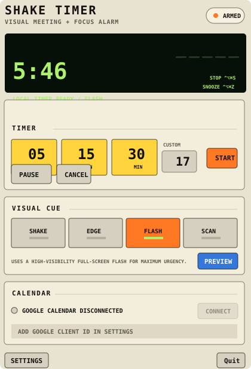

# ShakeTimer

ShakeTimer is a tiny macOS menu-bar timer for people who miss normal notifications while deep in focus or agentic workflows.

The core idea is simple: when a timer or meeting reminder fires, the app gives a hard-to-miss visual cue on every display instead of relying on Notification Center. The default cue is a desktop-shake-style overlay, and the cue system is extensible so you can choose other screen effects.



## What it does

- Runs as a native macOS menu-bar app.
- Starts quick timers or a custom timer from the menu.
- Shows dismiss/snooze hotkeys directly in the timer display.
- Provides selectable visual cues:
  - Desktop Shake
  - Edge Pulse
  - Screen Flash
  - Scan Sweep
- Includes a Google Calendar integration path for meeting reminders.
- Avoids standard notifications as the primary alarm channel.

## Why

This is built as a personal reliability hack: if normal notifications are disabled, ignored, or buried, ShakeTimer still creates a visible cue that interrupts the current visual field enough to bring attention back.

## Run locally

```bash
swift run ShakeTimer
```

## Validate

```bash
swift build --product ShakeTimer
swift run ShakeTimerCoreChecks
```
